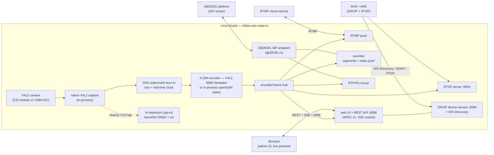
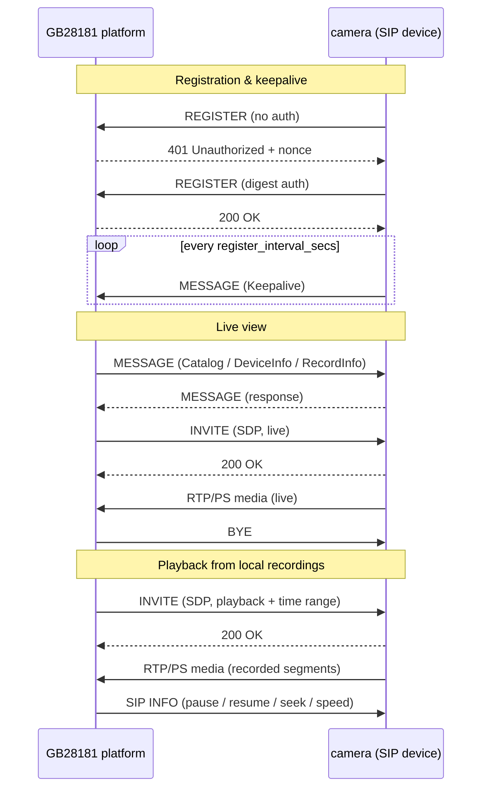

# MiBee Eye (蜂眼) — Rust

[](LICENSE)
[](https://rustup.rs)

[中文文档](README_zh.md)

ONVIF / GB28181 IP-camera service that turns any Linux board into a camera
— the **Rust implementation** of MiBee Eye. A sibling [Go implementation](https://github.com/xiqing85/mibee-eye-go)
exists with a different deployment profile — see
[Which implementation should I use?](#which-implementation-should-i-use).

Captures H.264 video with native V4L2/libcamera (capture and encode fully
in-process), streams via RTSP/RTMP, speaks ONVIF Profile S and GB28181 for NVR
integration, records continuously with playback support, and can run on-device
NanoDet object detection.

## Which implementation should I use?

Both implementations speak the same protocols (ONVIF Profile S, GB28181,
RTSP, RTMP), share the same SPEC v1 web UI/API, and interoperate with the same
NVRs — pick by deployment profile:

| Pick the **Go** implementation when… | Pick the **Rust** implementation when… |
|---|---|
| You want the quickest path: zero-CGO build, stock cross-compile | The board is memory/flash constrained (~2 MB binary; see the measured full-load RSS below) |
| You want HLS browser playback out of the box | You want the OSD watermark burned into every output |
| You need the i18n UI or the runtime metrics API | You want capture + encode fully in-process (no capture subprocess) |
| You prefer hacking on a Go codebase | You prefer hacking on a Rust codebase |

Both: AI detection (NanoDet, opt-in) · GB 35114 A-level (opt-in) · continuous
recording with GB28181 playback · imaging controls · snapshot.

> **Design note** — the Go implementation drives libcamera through the
> `mtxrpicam`/`rpicam-vid` front end (a subprocess pipe), and uses `ffmpeg`
> only for the optional AI keyframe decode (HLS is a pure-Go MPEG-TS
> segmenter, no ffmpeg); this Rust implementation captures and encodes
> natively via V4L2, so the service runs with no subprocesses at all.

---

## Features

| Feature | Status | Description |
|---------|--------|-------------|
| **ONVIF Profile S** | ✅ | Device/Media/Imaging SOAP server + WS-Discovery (port 8080) |
| **RTSP Streaming** | ✅ | H.264 video streaming (port 8554) |
| **GB28181 Device** | ✅ | SIP registration (UDP/TCP), Catalog/DeviceInfo/RecordInfo queries, live/playback/download PS streaming, SIP INFO playback control, platform snapshot commands — powered by [gb28181-rs](https://github.com/mickeyzzc/gb28181-rs) |
| **GB 35114 A-level** | ✅ | Optional SM2 certificate REGISTER auth + keyed-SM3 integrity (`--features gb35114`) |
| **Web Management UI** | ✅ | Embedded SPEC v1 admin panel: live preview, config, events (port 8088) |
| **Local Recording** | ✅ | Continuous H.264 segments + `index.jsonl`, retention & storage cap (GB28181 playback source) |
| **RTMP Push** | ✅ | Push the stream to cloud RTMP services |
| **AI Detection** | ✅ | NanoDet-Plus ONNX object detection on shared pre-encode frames — `--features ai`, see [docs/features/ai-detection.md](docs/features/ai-detection.md) |
| **OSD Watermark** | ✅ | Custom text + real-time clock burned into every output (RTSP/RTMP/recordings/GB28181) |
| **Snapshot** | ✅ | JPEG capture via HTTP GET |
| **Image Controls** | ✅ | Brightness, contrast, saturation, sharpness |
| **Motion Detection** | 🚧 | Frame-delta detector implemented (`src/motion/`) but not yet wired into the web API |
| **Multi-Camera** | 🚧 | Reserved — see [docs/features/multi-camera.md](docs/features/multi-camera.md) |
| **WebRTC** | 🚧 | Reserved — see [docs/features/webrtc.md](docs/features/webrtc.md) |
| **H.265/HEVC** | 🚧 | Reserved — see [docs/features/h265.md](docs/features/h265.md) |

---

## Architecture



Single capture pipeline fans out to every consumer: the watermark is burned
pre-encode so RTSP, RTMP, recordings, GB28181 PS streams and the web preview
all carry it; AI detection taps the shared pre-encode YUV so inference never
touches the capture or encoding path.

### GB28181 interaction overview



### Indicative footprint on RPi 3B (720p@15fps)

| Metric | Go implementation | Rust implementation |
|--------|-------------------|---------------------|
| Binary size | ~15 MB | ~2 MB |
| Memory usage (full feature set) | ~15–25 MB lean; ~74 MB main process measured (AI build)¹ | **~93 MB measured** (v0.2.0, re-confirmed on current main — see below) |
| Subprocess dependencies | mtxrpicam + ffmpeg (HLS) | none |
| CPU usage | ~15% lean; ~2.2–2.8 cores measured (AI build)¹ | **~1.4 cores measured** (v0.2.0, see below) |

Measured 2026-09-14 on `rpi3b-storage` (RPi 3B, OV5647 1280×720@15, v0.2.0,
hardware V4L2 M2M encoder `/dev/video11`, GB28181 registered + recording +
watermark ON, AI OFF, per-frame INFO logging ON, one RTSP/TCP client, 60 s,
13 samples): RSS flat at 93.8 MB (max = avg — steady state, no client
overhead on top: a no-client sample reads the same), CPU 124–146%
(≈139% avg of the four cores). A bare pipeline without GB28181/recording/
watermark sits far lower — treat these as full-feature numbers, and
reproduce on your own board with [`bench/rpi-bench.sh`](bench/rpi-bench.sh).
Re-measured 2026-09-17 on the same host/camera/config (current main):
RSS flat at 93.3 MB, CPU 114–145% — unchanged.

¹ Go-side figures measured 2026-09-17 on `rpi3b-cam` (RPi 3B, IMX219
1280×720@15, AI build, `rpicamvid` capture mode, GB28181 registered,
one RTSP/TCP client): RSS 71–79 MB (avg 74), CPU 179–278% — main
process only; the rpicam-vid/ffmpeg capture subprocesses are extra.

---

## Quick Start

### Native Build

```bash
git clone https://github.com/xiqing85/mibee-eye-rs.git
cd mibee-eye-rs
cargo build --release
```

Prebuilt binaries for Linux (aarch64 gnu/musl, x86_64 musl) are available on
the [Releases](https://github.com/xiqing85/mibee-eye-rs/releases) page.

### Cross-compile for ARM64 (RPi)

```bash
# Option 1: rust-lld (fully static, no external tools — recommended)
rustup target add aarch64-unknown-linux-musl
make cross-build

# Option 2: Zig
cargo install cargo-zigbuild
make cross-build-zig

# Option 3: Docker cross
cargo install cross
make cross-build-cross

# Option 4: Native GCC toolchain
make cross-build-native
```

The AI feature builds with `make cross-build` too (`--features ai`); the
resulting binary loads `libonnxruntime.so` at runtime (see
[docs/features/ai-detection.md](docs/features/ai-detection.md)).

### Deploy to your board

```bash
# Quick install (after cross-build)
./deploy/install.sh pi@192.168.1.100

# Or manually via Makefile
make deploy-cross REMOTE_HOST=pi@192.168.1.100
```

See the [deployment guide on mibeecam docs](https://www.mlsbs.top/docs/mibeecam)
for detailed deployment instructions.

---

## Configuration

Copy and edit the example config:

```bash
cp config.example.toml config.toml
# Edit for your camera and network
```

Key settings:

| Section | Key | Default | Description |
|---------|-----|---------|-------------|
| `[camera]` | `device` | `/dev/video0` | V4L2 camera device — capture is always native (in-process); the legacy `mode` key from Go-version configs is accepted but ignored |
| `[camera]` | `encoder` | `auto` | Encoder path: `auto` (probe `encoder_device`, fall back to software), `hardware` (V4L2 M2M only), `software` (openh264) — see [Hardware Support](#hardware-support) |
| `[camera]` | `encoder_device` | `/dev/video11` | V4L2 M2M encoder node probed by `encoder = auto/hardware` (bcm2835-codec-encode on Pi; configure per SoC) |
| `[camera]` | `width` / `height` | 1280×720 | Capture resolution |
| `[camera]` | `fps` | 15 | Frames per second |
| `[camera]` | `bitrate` | 2000000 | Target bitrate (bps) |
| `[camera.substream]` | `enabled` | `false` | Low-resolution bandwidth-saving substream (640×360@15, 400 kbps): second encoder session from the downscaled capture — RTSP `/sub` mount + ONVIF `sub` profile + web `stream.sub.mse`; main stream, recording and GB28181 stay on the main encode |
| `[rtsp]` | `port` | 8554 | RTSP server port |
| `[rtmp]` | `enabled` / `url` | `false` / — | Push the stream to an RTMP server |
| `[onvif]` | `port` | 8080 | ONVIF SOAP/HTTP port |
| `[onvif]` | `password` | — | ONVIF authentication (set this!) |
| `[onvif]` | `events_enabled` | `true` | Pull-Point events service: AI motion alarms as MotionAlarm for NVR subscribers |
| `[web]` | `port` | 8088 | Web admin UI port (credentials mirror ONVIF by default) |
| `[gb28181]` | `enabled` | `false` | SIP platform registration (`transport`: udp/tcp) |
| `[recording]` | `enabled` | `false` | Continuous H.264 segments (600s / 3-day retention / 8192MB cap) |
| `[storage.local]` | `path` / `retention_days` | — | Recording directory and retention |
| `[watermark]` | `enabled` / `text` | `false` / — | OSD watermark: text + RTC, position, font size, font path |
| `[features.ai]` | `enabled` | `false` | NanoDet detection: model, confidence, interval, memory/core guardrails |
| `[motion]` | `enabled` | `false` | Motion detection (not yet wired to the web API) |

Environment variables with the `MIBEE_EYE_` prefix override any file setting:

```bash
MIBEE_EYE_ONVIF_PASSWORD=secret ./mibee-eye-raspi-rs
```

Full reference: [config.example.toml](config.example.toml)

---

## Web API (SPEC v1)

The embedded web UI on `:8088` is served by a JSON REST API shared across the
MiBee camera projects. Responses use the `{"ok":true,"data":…}` /
`{"ok":false,"error","message"}` envelope; authentication is cookie-session
with double-submit CSRF; capabilities are negotiated so clients only render
what the device supports.

| Endpoint | Description |
|----------|-------------|
| `POST /api/auth/login` · `/api/auth/logout` · `GET /api/auth/session` | Cookie session + CSRF token |
| `GET /api/cameras` | Camera resource model (single-camera device: `id="0"`) |
| `GET /api/config` · `PUT /api/config` | Read config; partial-merge write (absent sections untouched) |
| `GET /api/detections` | Latest AI detections (`{"enabled":false}` when the AI feature is off) |
| `GET /api/ai/models` · `POST /api/ai/models/{id}/activate` | Model registry & runtime switch (feature `ai`) |
| `GET /api/events` | SSE event channel (`ai_detection`, config changes, …) |
| `GET /snapshot` | JPEG snapshot |

All AI failures are fail-open: a missing model or ONNX runtime degrades to
`ai:false` capability — never fabricated detections.

---

## ONVIF Integration

The ONVIF server implements **Profile S** (Device, Media, Imaging) SOAP
services over HTTP, powered by [onvif-device-rs](https://github.com/mickeyzzc/onvif-rs).
It is designed to integrate with:

- **MiBee NVR** — automatic discovery via WS-Discovery on the local network
- **Synology Surveillance Station** — add camera manually via ONVIF endpoint
- **Blue Iris** — ONVIF camera integration
- **Scrypted** — HomeKit Secure Video bridge
- **Any ONVIF-compatible NVR/VMS**

### WS-Discovery

The service announces itself via WS-Discovery multicast probes. NVRs
auto-discover the camera without manual configuration.

### Endpoint

```
http://<camera-ip>:8080/onvif/device_service
```

### Media Profile

| Parameter | Value |
|-----------|-------|
| Video Codec | H.264 (Baseline/Main/High) |
| Resolution | 640×480 to 2592×1944 |
| Framerate | Up to 30 fps |
| Bitrate | Configurable (default 2 Mbps) |
| RTSP Endpoint | `rtsp://<ip>:8554/stream` |

---

## Hardware Support

### Boards & encoders

**Any Linux board works.** Capture is generic V4L2 (`/dev/video0`,
configurable — USB/UVC cameras work anywhere). For encoding, `camera.encoder`
selects the path:

| `camera.encoder` | Behaviour |
|------------------|-----------|
| `auto` (default) | Probe `camera.encoder_device` (`/dev/video11` by default) — use the V4L2 M2M **hardware** encoder when the node is M2M-capable (Raspberry Pi family, i.MX coda, …), otherwise fall back to the in-process **software** encoder (openh264) |
| `hardware` | V4L2 M2M only — startup fails with clear diagnostics when the node is missing or not M2M-capable |
| `software` | Always openh264 — no encoder device needed; mind the CPU budget on weak boards (≤720p15 on A53-class) |

So: Raspberry Pi 3/4/5 (and Zero 2 W / CM) hardware-encode out of the box;
x86 boxes, NAS and most arm SBCs run with the software encoder automatically.
AI capability gating is memory/model based (see
[hardware/capability.rs](src/hardware/capability.rs)).

| Model | Camera Interface | Notes |
|-------|------------------|-------|
| **RPi 3B** | CSI (V4L2) | Recommended: OV5647 camera module |
| **RPi 4** | CSI (V4L2) | Higher throughput for 1080p |
| **RPi 5** | CSI (V4L2) | Best performance, dual CSI |

### Camera Modules

| Module | Sensor | Max Resolution | Focus | Notes |
|--------|--------|----------------|-------|-------|
| Pi Camera V1 | OV5647 | 2592×1944 | Fixed | Production-tested |
| Pi Camera V2 | IMX219 | 3280×2464 | Fixed | Better low-light |
| Pi Camera V3 | IMX708 | 4608×2592 | Autofocus | PDAF, HDR |
| Pi HQ Camera | IMX477 | 4056×3040 | Manual | Interchangeable lens |
| USB/UVC | Various | Various | Various | `/dev/video*` |

### Resource Requirements

| Model | Memory | Storage | Network |
|-------|--------|---------|---------|
| RPi 3B | 1 GB | 8 GB SD + USB disk | 100 Mbps |
| RPi 4 | 2-8 GB | 16 GB+ SD | 1 Gbps |
| RPi 5 | 4-8 GB | 16 GB+ SD | 1 Gbps |

---

## Reserved Features

These features are designed but not yet implemented. Enabling them in config
logs a warning and gracefully degrades.

| Feature | Doc | Status |
|---------|-----|--------|
| Multi-Camera | [docs/features/multi-camera.md](docs/features/multi-camera.md) | 🚧 |
| WebRTC | [docs/features/webrtc.md](docs/features/webrtc.md) | 🚧 |
| H.265/HEVC | [docs/features/h265.md](docs/features/h265.md) | 🚧 |

---

## Development

### Prerequisites

- **Rust** 1.88+ (install via `rustup`)
- **V4L2** development headers (for native builds)
  - Debian: `sudo apt install libv4l-dev`
  - Arch: `sudo pacman -S v4l-utils`

### Commands

```bash
# Build
cargo build --release

# Test
cargo test

# Lint
cargo clippy -- -D warnings

# Format check
cargo fmt --check

# Run locally
cargo run --release
```

### Feature Flags

Default features: `v4l2-encoder` + `software-encoder` (hardware encode with
automatic openh264 fallback — the right choice on any board).

```bash
# In-process software encoder (openh264) — default; required for the
# auto-fallback on boards without a V4L2 M2M encoder node
cargo build --release --features "software-encoder"

# V4L2 M2M hardware encoder (H.264) — default
cargo build --release --features "v4l2-encoder"

# Hardware-encoder-only build for constrained flash (no openh264 vendored C)
cargo build --release --no-default-features --features "v4l2-encoder"

# AI detection (NanoDet + ONNX Runtime, loaded dynamically)
cargo build --release --features "ai"

# GB 35114 A-level security (SM2 cert auth + keyed-SM3 integrity)
cargo build --release --features "gb35114"

# Remote segment-storage backends (WebDAV / S3 / SMB-mount) — compile-time
# opt-in `StorageBackend` implementations. Pure-Rust TLS (rustls): safe for
# the musl static cross-build, no OpenSSL linkage. Credentials come from
# environment variables (WEBDAV_* / S3_* / SMB_MOUNT_PATH — see the module
# docs in src/storage/). Note: the GB28181 recorder always writes local
# disk; these backends serve integrations that consume the crate as a
# library.
cargo build --release --features "storage-webdav"
cargo build --release --features "storage-s3"
cargo build --release --features "storage-smb"

# Reserved features — placeholders for planned capabilities (no-op today)
cargo build --release --features "multi-camera,webrtc,h265"
```

---

## License

Licensed under the **Apache License, Version 2.0** — see [LICENSE](LICENSE).
Third-party components keep their own licenses (MediaMTX-derived portions
remain MIT; the bundled Noto font remains OFL-1.1) — see [NOTICE](NOTICE).

> Licensing history: v0.1.0 shipped under CC BY-NC 4.0; the project
> relicensed to Apache-2.0 on 2026-09-13 (sole copyright holder).
