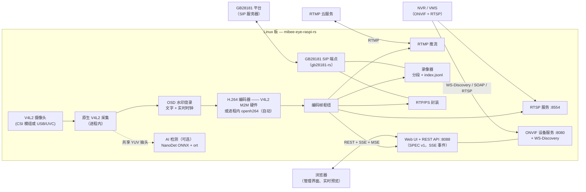
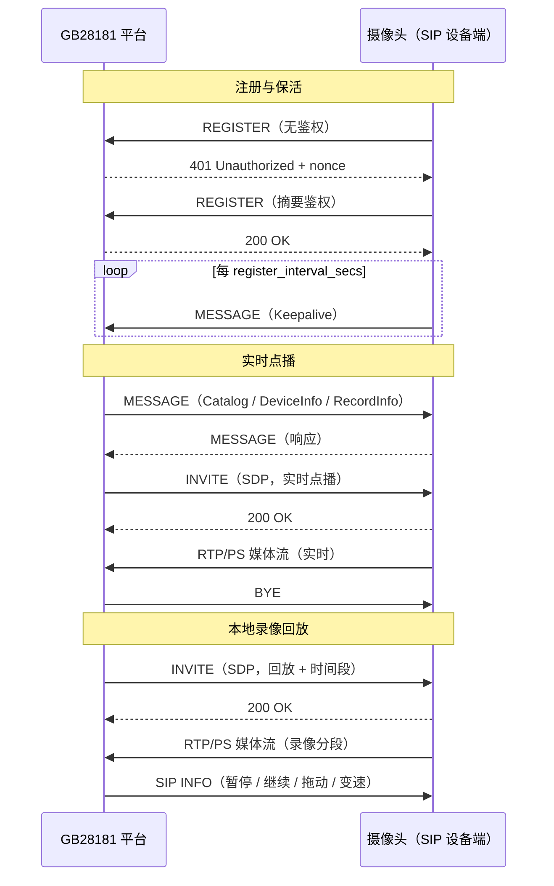

# MiBee Eye（蜂眼）— Rust

[](LICENSE)
[](https://rustup.rs)

[English](README.md)

把任意 Linux 板变成 ONVIF / GB28181 网络摄像头的服务 —— MiBee Eye 的 **Rust 实现**。
另有一个兄弟 [Go 实现](https://github.com/xiqing85/mibee-eye-go)，
部署画像不同，见[我该选哪个实现？](#我该选哪个实现)。

原生 V4L2/libcamera 采集 H.264 视频（采集与编码全程进程内完成），
RTSP/RTMP 双协议推流，内置 ONVIF Profile S 与 GB28181 国标设备端接入 NVR，
支持连续本地录像与国标回放，可选片上 NanoDet 目标检测。

## 我该选哪个实现？

两个实现说同样的协议（ONVIF Profile S、GB28181、RTSP、RTMP）、共享同一套
SPEC v1 Web UI/API、对接同样的 NVR —— 按部署画像选择：

| 选 **Go 实现**，当你… | 选 **Rust 实现**，当你… |
|---|---|
| 想最快跑起来：零 CGO 构建、原生交叉编译 | 板子内存/闪存吃紧（~2 MB 二进制；满配 RSS 见下方实测行） |
| 需要开箱即用的 HLS 浏览器播放 | 需要把 OSD 水印烧录进每一路输出 |
| 需要 i18n 界面或运行指标 API | 要求采集+编码全程进程内（无采集子进程） |
| 更想在 Go 代码上动手 | 更想在 Rust 代码上动手 |

两者共有：AI 检测（NanoDet，可选）· GB 35114 A 级（可选）· 连续录像 + GB28181
回放 · 图像调节 · 快照。

> **设计说明** —— Go 实现通过 `mtxrpicam`/`rpicam-vid` 前端驱动 libcamera
> （子进程管道），`ffmpeg` 仅用于可选的 AI 关键帧解码（HLS 为纯 Go
> MPEG-TS 分段器，不依赖 ffmpeg）；本 Rust 实现经 V4L2 原生采集与编码，
> 服务全程零子进程。

---

## 功能

| 功能 | 状态 | 说明 |
|------|------|------|
| **ONVIF Profile S** | ✅ | Device/Media/Imaging SOAP 服务 + WS-Discovery（端口 8080） |
| **RTSP 推流** | ✅ | H.264 视频流（端口 8554） |
| **GB28181 设备端** | ✅ | SIP 注册（UDP/TCP）、Catalog/DeviceInfo/RecordInfo 查询、实时/回放/下载 PS 流、SIP INFO 回放控制、平台抓拍指令 —— 基于 [gb28181-rs](https://github.com/mickeyzzc/gb28181-rs) |
| **GB 35114 A 级** | ✅ | 可选 SM2 证书注册认证 + keyed-SM3 完整性（`--features gb35114`） |
| **Web 管理界面** | ✅ | 内嵌 SPEC v1 管理面板：实时预览、配置、事件（端口 8088） |
| **本地录像** | ✅ | 连续 H.264 分段 + `index.jsonl`，保留期与容量上限（GB28181 回放源） |
| **RTMP 推流** | ✅ | 推流到云端 RTMP 服务 |
| **AI 检测** | ✅ | 共享编码前帧做 NanoDet-Plus ONNX 目标检测 —— `--features ai`，见 [docs/features/ai-detection.md](docs/features/ai-detection.md) |
| **OSD 水印** | ✅ | 自定义文字 + 实时时钟，烧录进所有输出（RTSP/RTMP/录像/GB28181） |
| **快照** | ✅ | HTTP GET 抓取 JPEG |
| **图像调节** | ✅ | 亮度、对比度、饱和度、锐度 |
| **移动侦测** | 🚧 | 帧差检测器已实现（`src/motion/`），尚未接入 Web API |
| **多摄像头** | 🚧 | 规划中 —— 见 [docs/features/multi-camera.md](docs/features/multi-camera.md) |
| **WebRTC** | 🚧 | 规划中 —— 见 [docs/features/webrtc.md](docs/features/webrtc.md) |
| **H.265/HEVC** | 🚧 | 规划中 —— 见 [docs/features/h265.md](docs/features/h265.md) |

---

## 架构



单一采集管线扇出到所有消费方：水印在编码前烧录，因此 RTSP、RTMP、录像、
GB28181 PS 流与 Web 预览全部携带；AI 检测从编码前共享 YUV 抽帧，
推理完全不影响采集与编码路径。

### GB28181 交互总览



### RPi 3B 参考资源占用（720p@15fps）

| 指标 | Go 实现 | Rust 实现 |
|------|---------|-----------|
| 二进制体积 | ~15 MB | ~2 MB |
| 内存占用（满配） | 精简配置 ~15–25 MB；AI 构建实测主进程 ~74 MB¹ | **实测 ~93 MB**（v0.2.0，当前 main 复测一致，见下） |
| 子进程依赖 | mtxrpicam + ffmpeg（HLS） | 无 |
| CPU 占用 | 精简配置 ~15%；AI 构建实测 ~2.2–2.8 核¹ | **实测 ~1.4 核**（v0.2.0，见下） |

2026-09-14 于 `rpi3b-storage` 实测（RPi 3B、OV5647 1280×720@15、v0.2.0、
`/dev/video11` 硬件 V4L2 M2M 编码、GB28181 已注册 + 录像 + 水印开启、
AI 关闭、逐帧 INFO 日志开启、1 路 RTSP/TCP 拉流、60 秒 13 采样）：RSS
稳定 93.8 MB（最大值=平均值——稳态，且无客户端时采样读数相同，即拉流
本身不增内存）；CPU 124–146%（四核均值 ≈139%）。不含 GB28181/录像/水印
的裸管线要低得多——以上是满配口径的数字；可用
[`bench/rpi-bench.sh`](bench/rpi-bench.sh) 在自己的板子上复测。
2026-09-17 于同主机/相机/配置（当前 main）复测：RSS 稳定 93.3 MB、CPU 114–145%——无变化。

¹ Go 侧数字 2026-09-17 于 `rpi3b-cam` 实测（RPi 3B、IMX219 1280×720@15、
AI 构建、`rpicamvid` 采集模式、GB28181 已注册、1 路 RTSP/TCP 拉流）：
RSS 71–79 MB（均值 74）、CPU 179–278%——仅主进程；rpicam-vid/ffmpeg
采集子进程的开销另计。

---

## 快速开始

### 本机构建

```bash
git clone https://github.com/xiqing85/mibee-eye-rs.git
cd mibee-eye-rs
cargo build --release
```

Linux 预编译产物（aarch64 gnu/musl、x86_64 musl）见
[Releases](https://github.com/xiqing85/mibee-eye-rs/releases) 页面。

### 交叉编译 ARM64（树莓派）

```bash
# 方式一：rust-lld（全静态、零外部工具 —— 推荐）
rustup target add aarch64-unknown-linux-musl
make cross-build

# 方式二：Zig
cargo install cargo-zigbuild
make cross-build-zig

# 方式三：Docker cross
cargo install cross
make cross-build-cross

# 方式四：原生 GCC 工具链
make cross-build-native
```

AI 特性同样随 `make cross-build` 构建（`--features ai`），
产物在运行时动态加载 `libonnxruntime.so`（详见
[docs/features/ai-detection.md](docs/features/ai-detection.md)）。

### 部署到你的板子

```bash
# 交叉构建后一键安装
./deploy/install.sh pi@192.168.1.100

# 或通过 Makefile
make deploy-cross REMOTE_HOST=pi@192.168.1.100
```

详细部署指南见 [mibeecam 文档站](https://www.mlsbs.top/docs/mibeecam)。

---

## 配置

复制并编辑示例配置：

```bash
cp config.example.toml config.toml
# 按你的相机与网络环境修改
```

主要配置项：

| 节 | 键 | 默认值 | 说明 |
|----|----|--------|------|
| `[camera]` | `device` | `/dev/video0` | V4L2 设备节点 —— 采集恒为原生进程内实现；兼容保留的 `mode` 键（Go 版配置习惯）会被接受但忽略 |
| `[camera]` | `encoder` | `auto` | 编码路径：`auto`（探测 `encoder_device`，失败回退软编）、`hardware`（仅 V4L2 M2M）、`software`（openh264）—— 见[硬件支持](#硬件支持) |
| `[camera]` | `encoder_device` | `/dev/video11` | `encoder = auto/hardware` 探测的 V4L2 M2M 编码节点（树莓派为 bcm2835-codec-encode；按 SoC 配置） |
| `[camera]` | `width` / `height` | 1280×720 | 采集分辨率 |
| `[camera]` | `fps` | 15 | 帧率 |
| `[camera]` | `bitrate` | 2000000 | 目标码率（bps） |
| `[camera.substream]` | `enabled` | `false` | 低分辨率省流子码流（640×360@15、400 kbps）：对主采集帧降采样后的第二路编码 —— RTSP `/sub` 挂载 + ONVIF `sub` Profile + Web `stream.sub.mse`；主码流、录像与 GB28181 仍走主编码 |
| `[rtsp]` | `port` | 8554 | RTSP 端口 |
| `[rtmp]` | `enabled` / `url` | `false` / — | 推流到 RTMP 服务 |
| `[onvif]` | `port` | 8080 | ONVIF SOAP/HTTP 端口 |
| `[onvif]` | `password` | — | ONVIF 鉴权密码（务必设置！） |
| `[onvif]` | `events_enabled` | `true` | Pull-Point 事件服务：AI 运动告警以 MotionAlarm 推送给订阅的 NVR |
| `[web]` | `port` | 8088 | Web 管理端口（凭证缺省沿用 ONVIF） |
| `[gb28181]` | `enabled` | `false` | SIP 平台注册（`transport`：udp/tcp） |
| `[recording]` | `enabled` | `false` | 连续 H.264 分段（600s / 保留 3 天 / 上限 8192MB） |
| `[storage.local]` | `path` / `retention_days` | — | 录像目录与保留期 |
| `[watermark]` | `enabled` / `text` | `false` / — | OSD 水印：文字 + 实时钟、位置、字号、字体路径 |
| `[features.ai]` | `enabled` | `false` | NanoDet 检测：模型、置信度、间隔、内存/核心护栏 |
| `[motion]` | `enabled` | `false` | 移动侦测（尚未接入 Web API） |

`MIBEE_EYE_` 前缀的环境变量可覆盖任意文件配置：

```bash
MIBEE_EYE_ONVIF_PASSWORD=secret ./mibee-eye-raspi-rs
```

完整参考：[config.example.toml](config.example.toml)

---

## Web API（SPEC v1）

内嵌 Web UI（`:8088`）背后的 JSON REST API 在 MiBee 各摄像头项目间统一。
响应信封为 `{"ok":true,"data":…}` / `{"ok":false,"error","message"}`；
鉴权采用 cookie 会话 + 双提交 CSRF；能力协商让客户端只渲染设备支持的功能。

| 端点 | 说明 |
|------|------|
| `POST /api/auth/login` · `/api/auth/logout` · `GET /api/auth/session` | cookie 会话 + CSRF token |
| `GET /api/cameras` | 相机资源模型（单相机设备恒为 `id="0"`） |
| `GET /api/config` · `PUT /api/config` | 读配置；部分合并写入（未涉及的节保持不变） |
| `GET /api/detections` | 最新 AI 检测结果（AI 关闭时返回 `{"enabled":false}`） |
| `GET /api/ai/models` · `POST /api/ai/models/{id}/activate` | 模型注册表与运行时切换（feature `ai`） |
| `GET /api/events` | SSE 事件通道（`ai_detection`、配置变更等） |
| `GET /snapshot` | JPEG 快照 |

AI 一切失败均 fail-open：模型或 ONNX 运行库缺失时能力降级为 `ai:false`，
绝无假数据。

---

## ONVIF 集成

ONVIF 服务实现 **Profile S**（Device、Media、Imaging）SOAP 服务，
基于 [onvif-rs](https://github.com/mickeyzzc/onvif-rs)，可对接：

- **MiBee NVR** —— 局域网 WS-Discovery 自动发现
- **Synology Surveillance Station** —— 手动添加 ONVIF 端点
- **Blue Iris** —— ONVIF 相机接入
- **Scrypted** —— HomeKit Secure Video 桥接
- **任何 ONVIF 兼容 NVR/VMS**

### WS-Discovery

服务通过 WS-Discovery 组播应答 Probe，NVR 无需手工配置即可自动发现相机。

### 端点

```
http://<相机IP>:8080/onvif/device_service
```

### 媒体 profile

| 参数 | 取值 |
|------|------|
| 视频编码 | H.264（Baseline/Main/High） |
| 分辨率 | 640×480 至 2592×1944 |
| 帧率 | 最高 30 fps |
| 码率 | 可配置（默认 2 Mbps） |
| RTSP 地址 | `rtsp://<ip>:8554/stream` |

---

## 硬件支持

### 板型与编码器

**任意 Linux 板可用。** 采集是通用 V4L2（`/dev/video0`，可配置 —— USB/UVC
相机随处可用）。编码由 `camera.encoder` 决定路径：

| `camera.encoder` | 行为 |
|------------------|------|
| `auto`（默认） | 探测 `camera.encoder_device`（默认 `/dev/video11`）——节点具备 M2M 能力（树莓派家族、i.MX coda 等）则用 V4L2 M2M **硬件**编码，否则自动回退进程内**软件**编码（openh264） |
| `hardware` | 仅 V4L2 M2M——节点缺失或非 M2M 时启动报错并给出诊断 |
| `software` | 恒用 openh264——无需编码设备；弱板注意 CPU 预算（A53 级建议 ≤720p15） |

即：树莓派 3/4/5（含 Zero 2 W / CM）开箱硬编；x86 主机、NAS 与多数 arm SBC
自动以软件编码运行。AI 能力门按内存/型号判定（见
[hardware/capability.rs](src/hardware/capability.rs)）。

| 型号 | 相机接口 | 说明 |
|------|---------|------|
| **RPi 3B** | CSI（V4L2） | 推荐 OV5647 模组 |
| **RPi 4** | CSI（V4L2） | 1080p 吞吐更充裕 |
| **RPi 5** | CSI（V4L2） | 性能最佳，双 CSI |

### 摄像头模组

| 模组 | 传感器 | 最大分辨率 | 对焦 | 说明 |
|------|--------|-----------|------|------|
| Pi Camera V1 | OV5647 | 2592×1944 | 固定焦 | 生产验证 |
| Pi Camera V2 | IMX219 | 3280×2464 | 固定焦 | 低照度更优 |
| Pi Camera V3 | IMX708 | 4608×2592 | 自动对焦 | PDAF、HDR |
| Pi HQ Camera | IMX477 | 4056×3040 | 手动 | 可换镜头 |
| USB/UVC | 各类 | 各类 | 各类 | `/dev/video*` |

### 资源需求

| 型号 | 内存 | 存储 | 网络 |
|------|------|------|------|
| RPi 3B | 1 GB | 8 GB SD + USB 磁盘 | 100 Mbps |
| RPi 4 | 2-8 GB | 16 GB+ SD | 1 Gbps |
| RPi 5 | 4-8 GB | 16 GB+ SD | 1 Gbps |

---

## 规划中特性

以下特性已完成设计但尚未实现，配置中启用只会打告警并优雅降级。

| 特性 | 文档 | 状态 |
|------|------|------|
| 多摄像头 | [docs/features/multi-camera.md](docs/features/multi-camera.md) | 🚧 |
| WebRTC | [docs/features/webrtc.md](docs/features/webrtc.md) | 🚧 |
| H.265/HEVC | [docs/features/h265.md](docs/features/h265.md) | 🚧 |

---

## 开发

### 前置要求

- **Rust** 1.88+（`rustup` 安装）
- **V4L2** 开发头文件（本机构建）
  - Debian：`sudo apt install libv4l-dev`
  - Arch：`sudo pacman -S v4l-utils`

### 常用命令

```bash
# 构建
cargo build --release

# 测试
cargo test

# Lint
cargo clippy -- -D warnings

# 格式检查
cargo fmt --check

# 本地运行
cargo run --release
```

### 特性开关

默认特性：`v4l2-encoder` + `software-encoder`（硬件编码 + openh264 自动
回退 —— 任意板都适用的组合）。

```bash
# 进程内软件编码器（openh264）—— 默认开启；无 V4L2 M2M 节点的板
# 依赖它做 auto 回退
cargo build --release --features "software-encoder"

# V4L2 M2M 硬件编码器（H.264）—— 默认开启
cargo build --release --features "v4l2-encoder"

# 仅硬编的精简构建（闪存吃紧时用，免去 openh264 的 vendored C 编译）
cargo build --release --no-default-features --features "v4l2-encoder"

# AI 检测（NanoDet + ONNX Runtime，动态加载）
cargo build --release --features "ai"

# GB 35114 A 级安全（SM2 证书认证 + keyed-SM3 完整性）
cargo build --release --features "gb35114"

# 远程录像存储后端（WebDAV / S3 / SMB 挂载点）—— 编译期可选的
# `StorageBackend` 实现。纯 Rust TLS（rustls）：musl 静态交叉构建安全，
# 不引入 OpenSSL。凭证一律来自环境变量（WEBDAV_* / S3_* / SMB_MOUNT_PATH，
# 详见 src/storage/ 模块文档）。注意：GB28181 录像器恒写本地磁盘，
# 这些后端面向把本 crate 当库使用的集成方。
cargo build --release --features "storage-webdav"
cargo build --release --features "storage-s3"
cargo build --release --features "storage-smb"

# 规划中特性 —— 占位 feature（当前无实际作用）
cargo build --release --features "multi-camera,webrtc,h265"
```

---

## 许可证

以 **Apache License, Version 2.0** 授权 —— 详见 [LICENSE](LICENSE)。
第三方组件沿用各自许可（MediaMTX 衍生部分为 MIT；内置 Noto 字体为
OFL-1.1）—— 见 [NOTICE](NOTICE)。

> 许可历史：v0.1.0 曾以 CC BY-NC 4.0 发布；2026-09-13 起项目改为
> Apache-2.0（唯一版权持有人变更）。
