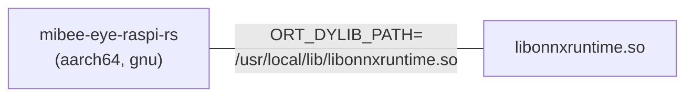
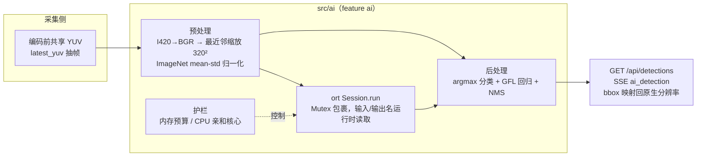
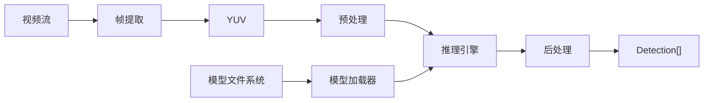

# AI 检测功能设计文档

> **状态：已实现**（编译期 `--features ai`，运行时配置 `[features.ai]`）。
> 快速启用：`make cross-build` 即含 AI；设备上安装 `libonnxruntime.so`
> （系统路径或 `ORT_DYLIB_PATH`）并放置模型文件后，
> `[features.ai] enabled = true`。API：`GET /api/detections`、
> `GET /api/ai/models`、`POST /api/ai/models/{id}/activate`、SSE `ai_detection`。
> 模型/运行库缺失时 fail-open 降级为 `ai:false`，绝不输出假数据。

## 设计意图 (Design Intent)

AI 检测功能旨在超越简单的运动检测，为 mibee-eye-raspi-rs 提供基于深度学习的目标识别能力。该功能支持对人、车辆、动物等特定目标的实时检测，能够显著提升监控系统的智能化水平，减少误报并提供更有价值的告警信息。

当前的运动检测（基于帧差法）只能检测画面变化，无法区分运动物体类型。AI 检测功能通过集成预训练的计算机视觉模型，能够在每一帧视频中识别特定类别的物体，并返回检测框坐标和置信度。这为后续的智能告警、目标跟踪和行为分析奠定了基础。

**核心应用场景：**
- 人员入侵检测（区分人和动物）
- 车辆识别（车牌、车型）
- 宠物监控
- 异常行为分析（如滞留检测）

## 推理引擎选型（已定） (Chosen Inference Engine)

**已选定：ONNX Runtime via `ort` crate（Option A — `load-dynamic`）**

| 项目 | 决定 |
|------|------|
| 推理引擎 | ONNX Runtime（`ort` crate） |
| 版本 | `2.0.0-rc.13`（crates.io 最新；1.x 稳定版已全部 yanked） |
| Cargo 特性 | `ai = ["dep:ort"]`，`ort` 为 optional，**非默认** |
| 链接策略 | **`load-dynamic`**（`default-features = false`）— 编译期零 C++ 链接，运行时通过 `dlopen` 加载 `libonnxruntime.so` |
| 运行时配置 | `ORT_DYLIB_PATH=/usr/local/lib/libonnxruntime.so`（或与二进制同目录） |
| 交叉编译 | 已验证 `aarch64-unknown-linux-gnu`（项目 canonical 交叉编译目标，`make cross-build` / zigbuild） |

### 为什么选 `load-dynamic`（Option A）

1. **编译期零 C++ 链接**：`load-dynamic` 启用 `ort-sys/disable-linking` + `preload-dylibs`（libloading），不需要交叉 C++ 工具链，不需要从源码构建 ONNX Runtime（Option C 已排除）。
2. **`download-binaries` 是默认特性，必须关闭**：它会在构建期下载 glibc 版 ONNX Runtime 二进制并链接，破坏 musl 静态构建，且下载的二进制与 musl 不兼容。因此使用 `default-features = false`。
3. **运行时灵活性**：`libonnxruntime.so` 随二进制分发，路径由 `ORT_DYLIB_PATH` 控制，失败时优雅报错而非启动即崩。
4. **已验证**：`ort` 在隔离测试中同时通过 `aarch64-unknown-linux-musl` 和 `aarch64-unknown-linux-gnu` 的 `cargo check`；完整项目在 `aarch64-unknown-linux-gnu` + `--features v4l2-encoder,ai` 下 zigbuild 交叉编译成功。

> **注意**：完整项目的 musl 构建目前被 `shiguredo_v4l2` 的 ioctl 类型不匹配阻塞（与 ort 无关，项目已在 commit bca5ce5 切换到 gnu 交叉编译）。`ort` 本身在 musl 下编译通过，若 v4l2 问题修复，musl 静态构建仍可行。

### 部署模型（Option A）



- 交叉编译：`cargo zigbuild --release --features v4l2-encoder,ai --target aarch64-unknown-linux-gnu`
- 分发：`scp` 二进制 + `libonnxruntime.so`（从 ONNX Runtime 官方 release 下载 aarch64 版）到 Pi
- 运行时：设置 `ORT_DYLIB_PATH` 指向 `.so` 路径

### 备选方案（未采用）

- **Option B（`download-binaries` + gnu）**：构建期下载并链接 ONNX Runtime 二进制，二进制变为 glibc 依赖。未采用 — `load-dynamic` 已验证可用且更灵活。
- **Option C（从源码构建 ONNX Runtime for musl）**：过于复杂，明确排除。

## 实际实现 (Actual Implementation)



### 模型 (Model)

- **模型文件**: `models/nanodet-m.onnx`（4.6MB，NanoDet v1.0.0-alpha-1 release 的 `nanodet-plus-m_320.onnx`）
- **下载**: https://github.com/RangiLyu/nanodet/releases/tag/v1.0.0-alpha-1
- **许可证**: Apache-2.0（非 GPL）
- **输入**: `data` `[1, 3, 320, 320]` float32（NCHW）
- **输出**: `output` `[1, 2125, 112]` float32（point-major）
  - 2125 点 = 40^2 + 20^2 + 10^2 + 5^2，对应 strides [8, 16, 32, 64]
  - 112 通道 = 80 类 + 32 回归（4 边 x 8 bins，reg_max=7）
  - **注意**: 与计划初稿假设的 `[1, 108, 2100]`（3 strides）不同，实际模型为 4 个 FPN 层、point-major 布局
  - Sigmoid 已折叠进 ONNX 图内（已验证），后处理不再重复应用

### 预处理 (Preprocessing, T10)

`src/ai/preprocess.rs`:
1. YUV420 I420 → BGR（BT.601 全范围 JPEG 系数）
2. 最近邻缩放至 320x320
3. 归一化 `(pixel - mean) / std`，mean = [103.53, 116.28, 123.675]，std = [57.375, 57.12, 58.395]
4. NCHW float32 输出（B 平面、G 平面、R 平面）

### 后处理 (Post-processing, T11)

`src/ai/postprocess.rs`（参考 NanoDet ncnn `demo/ncnn/nanodet.cpp`）:
1. 分类: 每点前 80 通道 argmax（已 sigmoid，无需再应用）
2. GFL 回归: 每边 8 bins 做 softmax，期望距离 = `sum(j * softmax[j])`（stride 单位）
3. Bbox: `x1 = (grid_x - l) * stride`，`y1 = (grid_y - t) * stride`，`x2 = (grid_x + r) * stride`，`y2 = (grid_y + b) * stride`，clamp 到帧内
4. 按置信度过滤 + 每类 NMS（IoU 0.5）
5. 类索引 → COCO 80 类标签

### 推理管线 (Inference Pipeline, T9+T10+T11)

`src/ai/ortv.rs` `OrtDetector::detect()`:
1. `preprocess(frame_data, w, h, input_w, input_h)` → NCHW f32
2. `Tensor::from_array(([1, 3, h, w], data))`
3. `session.run(ort::inputs![input_name => tensor])`
4. `outputs[0].try_extract_tensor::<f32>()` → `&[f32]`
5. `postprocess(data, pre_nms_confidence)` → `Vec<Detection>`

Session 用 `Mutex<Session>` 包裹（`run()` 需要 `&mut self`）。输入/输出名称和输入形状从 session 读取，不硬编码。

### 分层硬件门控 (Tiered Gate, T1)

- `ai_lite_capable`: 内存 ≥ 1GB → 启用 NanoDet 类模型
- `ai_full_capable`: 内存 ≥ 2GB → 启用 YOLO 类模型（未来）
- Pi 3B (1GB) 满足 lite 门槛，可运行 NanoDet
## 未来方向与技术选型 (Future Direction & Tech Stack)

### 技术路线

AI 检测功能将采用 Rust 生态中的机器学习推理框架，配合预训练模型实现端侧推理。主要技术选型包括：

#### 推理引擎候选

**选项 1: TFLite (TensorFlow Lite)**
- 优势：成熟的移动端推理引擎，丰富的预训练模型
- Rust 绑定：`tflite-rs`
- 模型格式：TFLite (.tflite)
- 性能：在 ARM64 上有硬件加速支持（如有 NPU）

**选项 2: ONNX Runtime（✅ 已选定）**
- 优势：跨平台，模型格式统一，生态活跃
- Rust 绑定：`ort` (ONNX Runtime Rust 绑定)
- 模型格式：ONNX (.onnx)
- 性能：优化的推理引擎，支持多种硬件后端

**选项 3: Candle (Hugging Face)**
- 优势：纯 Rust 实现，与 Hugging Face 生态深度集成
- Rust 绑定：原生支持，无需 C FFI
- 模型格式：Safetensors (.safetensors)
- 性能：活跃开发，针对 ARM 优化

**推荐路径：** 优先评估 Candle，如生态不成熟则回退到 ONNX Runtime

#### 模型选择

针对 NVR 监控场景，推荐以下轻量级目标检测模型：

- **YOLOv8-Nano**：速度优先，适合实时检测
- **MobileNetV3-SSD**：资源占用低，适合 RPi 4/5
- **EfficientDet-Lite**：精度与速度平衡

模型部署流程：
1. 训练/下载预训练模型（COCO 数据集 + 自定义类别）
2. 转换为 TFLite/ONNX/Safetensors 格式
3. 量化为 INT8 以减少内存占用
4. 集成到 Rust 推理引擎中

### 架构设计



### Cargo 依赖（当前）

```toml
[dependencies]
# 推理引擎（已选定：ONNX Runtime，load-dynamic）
ort = { version = "2.0.0-rc.13", optional = true, default-features = false, features = ["load-dynamic"] }

[features]
default = ["v4l2-encoder"]
ai = ["dep:ort"]
```

## 硬件门控逻辑 (Hardware Gating Logic)

AI 检测功能对硬件资源有较高要求，需要通过硬件能力检测进行门控。

### 必需硬件

| 硬件规格 | 最低要求 | 推荐配置 | 说明 |
|---------|---------|---------|------|
| **RAM** | ≥ 2GB | ≥ 4GB | 模型推理需要内存缓冲区，INT8 量化模型约需 50-100MB |
| **CPU** | ARMv8 (4核) | ARM Cortex-A72+ | 推理对 CPU 要求高，多核可提升并发性能 |
| **架构** | aarch64 | aarch64 | 当前仅支持 64 位系统 |

### 可选硬件加速

| 加速设备 | 支持情况 | 性能提升 | 备注 |
|---------|---------|---------|------|
| **NPU** | Pi 5 (可选) | 2-5x | 需要推理引擎支持 NPU 后端 |
| **TPU** | Edge TPU | 5-10x | 外接设备，如 Coral USB Accelerator |
| **GPU** | VideoCore IV | 无 | 当前不计划支持 GPU 推理 |

### 设备兼容性矩阵

| 设备 | 内存 | AI 能力 | 推理模式 |
|------|------|---------|---------|
| **Pi 3B (1GB)** | 1GB | ❌ 不支持 | 内存不足，无法加载模型 |
| **Pi 3B (4GB)** | 4GB | ✅ 支持 | CPU 推理 |
| **Pi 4** | 2-8GB | ✅ 支持 | CPU 推理，可选 NPU |
| **Pi 5** | 4-8GB | ✅ 支持 | CPU/NPU 推理 |

### 检测逻辑

基于 `src/hardware/capability.rs` 的检测：

```rust
// 未来 API，当前未实现
pub struct AiCapabilityGate {
    memory_mb: u64,
    arch: String,
    has_npu: bool,
}

impl AiCapabilityGate {
    pub fn should_enable(&self) -> bool {
        self.memory_mb >= 2048 && self.arch == "aarch64"
    }

    pub fn recommended_backend(&self) -> AiBackend {
        if self.has_npu {
            AiBackend::Npu
        } else {
            AiBackend::Cpu
        }
    }
}
```

## 接口契约 (Interface Contract)

### 核心 Trait 定义

```rust
// 未来 API，当前未实现
use async_trait::async_trait;

/// AI 检测结果
#[derive(Debug, Clone)]
pub struct Detection {
    pub label: String,      // 类别名称（如 "person", "car"）
    pub confidence: f32,    // 置信度 [0.0, 1.0]
    pub bbox: (u32, u32, u32, u32), // (x, y, width, height)
}

/// AI 检测器 Trait
#[async_trait]
pub trait AiDetector: Send + Sync {
    /// 在视频帧上运行推理
    ///
    /// # 参数
    /// - `frame_data`: 原始视频帧数据（YUV 格式）
    /// - `width`: 帧宽度（像素）
    /// - `height`: 帧高度（像素）
    ///
    /// # 返回
    /// - `Ok(Vec<Detection>)`: 检测到的目标列表
    /// - `Err(FeatureError)`: 推理失败或硬件不支持
    async fn detect(
        &self,
        frame_data: &[u8],
        width: u32,
        height: u32,
    ) -> Result<Vec<Detection>, FeatureError>;

    /// 返回加载的模型名称
    fn model_name(&self) -> &str;
}
```

### 配置接口（未来）

```toml
# 未来配置，当前未实现
[ai]
enabled = true
model_path = "/var/lib/mibee-eye/models/yolov8n.tflite"
confidence_threshold = 0.5
max_detections = 100
backend = "cpu"  # "cpu" | "npu" | "tpu"
input_resolution = [640, 640]
quantization = "int8"  # "int8" | "float16" | "float32"
```

### 错误处理

```rust
// 未来 API，当前未实现
pub enum AiError {
    ModelLoadFailed(String),
    InferenceFailed(String),
    InsufficientMemory { required_mb: u64, available_mb: u64 },
    UnsupportedHardware(String),
}
```

## 解锁条件 (Unlock Conditions)

### 技术准备

- [ ] **模型获取**
  - [ ] 下载或训练预训练模型（YOLOv8-Nano）
  - [ ] 转换为目标格式（TFLite/ONNX/Safetensors）
  - [ ] 量化为 INT8 以减少内存占用
  - [ ] 验证模型在目标设备上的性能

- [x] **推理引擎集成（T8 完成）**
  - [x] 评估 Candle/ONNX Runtime/TFLite 的 Rust 绑定
  - [x] 选择并集成推理引擎到项目（ONNX Runtime / `ort` / `load-dynamic`）
  - [x] 验证交叉编译（`aarch64-unknown-linux-gnu` + zigbuild）
  - [ ] 实现模型加载和推理流程（T9）
  - [ ] 测试在 RPi 4/5 上的性能（FPS，延迟）

- [ ] **性能优化**
  - [ ] 实现输入图像预处理（resize, normalize）
  - [ ] 实现后处理（NMS, 过滤低置信度）
  - [ ] 优化内存分配（复用缓冲区）
  - [ ] 如可能，实现 NPU/TPU 加速

- [ ] **质量保证**
  - [ ] 单元测试（Mock 推理引擎）
  - [ ] 集成测试（真实视频流）
  - [ ] 性能基准测试（1080p@30fps 目标）
  - [ ] 内存泄漏检测

### 硬件验证

- [ ] 在 **Pi 4 (4GB)** 上测试 CPU 推理
- [ ] 在 **Pi 5** 上测试 NPU 推理（如可用）
- [ ] 在 **Pi 3B (1GB)** 上验证失败场景（内存不足）
- [ ] 在 **Pi 3B (4GB)** 上测试 CPU 推理

### 文档与配置

- [ ] 模型部署文档（下载、转换、放置路径）
- [ ] 配置文件示例（模型路径、阈值、后端）
- [ ] 性能调优指南（分辨率、批处理、量化）
- [ ] 故障排查手册（常见错误、日志分析）

### 发布检查

- [ ] 默认配置安全（不启用高风险功能）
- [ ] 优雅降级（AI 失败时回退到运动检测）
- [ ] 资源限制（单模型最大内存占用 < 256MB）
- [ ] 隐私保护（不上传视频流，本地推理）
## 模型注册表与运行时热切换（2026-09-07，SPEC v1 §4.6）

多模型支持按「同族换档」落地（`src/ai/registry.rs`）：

- **注册表**：`nanodet-plus-m-320`（`/var/lib/mibee-eye/models/nanodet-m.onnx`）、
  `nanodet-plus-m-416`（`nanodet-m-416.onnx`）与 `yolox-nano-416`
  （`yolox-nano.onnx`，跨族：YOLOX 解码器在 `src/ai/yolox.rs`——RGB letterbox /255
  预处理 + 原始 delta 解码（grid+exp、obj×cls）+ 3 层 floor 网格 + IoU 0.45 NMS）。
  配置 `features.ai.model` 指定启动模型；非默认 `model_path` 仍作自定义部署覆盖。
- **API**：`GET /api/ai/models`（清单 + active + available）、
  `POST /api/ai/models/{id}/activate`（热切换，`applied:"immediate"`，持久化
  `ai.model` 并广播 `ai_model_changed` SSE）。未知 id 404；模型文件缺失 409；
  加载失败回滚保持旧模型 500。capability `ai_models` 门控。
- **切换语义**：新检测器完整构建成功后才替换 `AiModule` 的检测器槽位（失败
  不扰动运行中的模型）；旧检测结果清空，下一次推理即用新模型。
- **网格参数化**：GFL 后处理的 FPN 网格按模型输入尺寸推导
  （`postprocess::Grid::for_input`，每层 `ceil(input/stride)²` 个点），
  不再写死 320 导出的 2125 点——416 导出（3598 点）与任何同族尺寸共用一个
  解码器，golden 用例同时覆盖 320/416 两套网格。
- **前端**：mibee-webui `static/js/ai.js`（能力门控的下拉切换器）。

后续跨族（YOLOX 等）与新解码器仍按本文件「分层判定」处理：解码器进产品
仓库的 `src/ai/`（产品层），模型清单经注册表扩展。

## 运行时上传拔插（2026-09-07 P3，SPEC v1 §4.6 capability `ai_upload`）

- `POST /api/ai/models/{id}`（multipart：`family` + `file`）：先落临时文件、
  **完整加载验证**（会话构建 + 族形状校验）通过后原子改名入册并持久化到
  `models/uploaded.json`（重启存活）；失败 400 且不留痕。id 语法
  `^[a-z0-9][a-z0-9-]{0,63}$`，重复 409，超 32MB 413。
- `DELETE /api/ai/models/{id}`：仅 `uploaded` 条目；运行中模型 409，内置 409。
- 配置 `features.ai.allow_upload`（默认 false）门控；模型文件是对推理引擎的
  不可信输入，生产环境按需开启。
- 注册表实现为「内置 + 上传叠加层」：`Registry::load(models_dir)` 启动时合并
  manifest，文件缺失的条目自动修剪。
