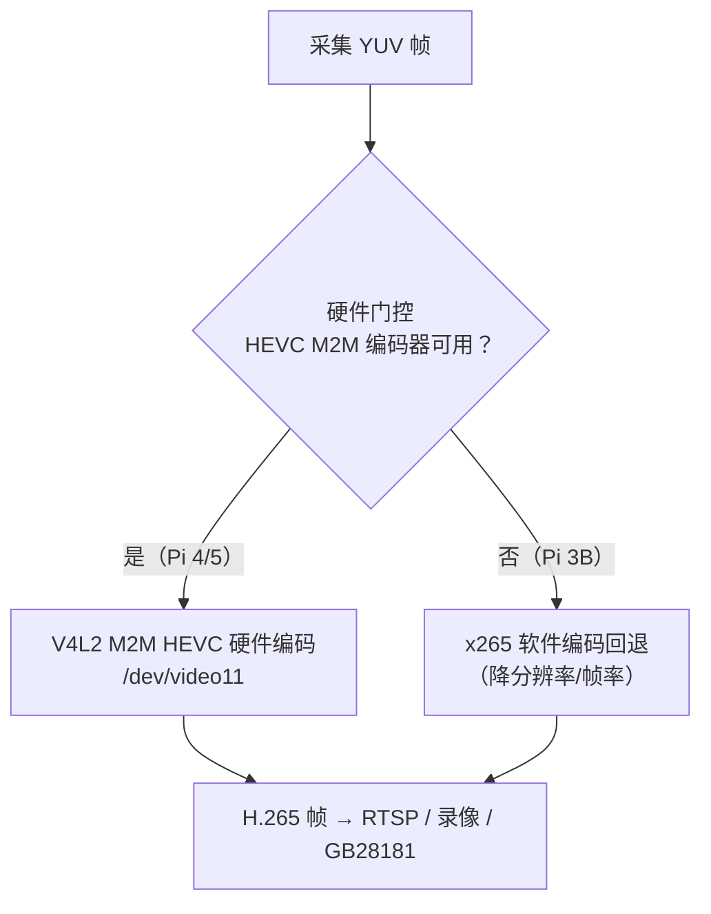
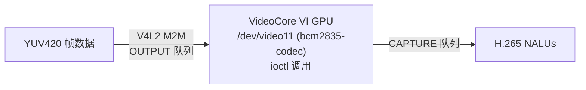

# H.265 (HEVC) 编码功能设计文档

> **状态：规划中，未实现**。配置 `[features.h265] enabled = true`
> 仅记录告警并优雅降级。本文为设计文档，非实现文档。

## 设计意图 (Design Intent)

H.265（HEVC, High Efficiency Video Coding）编码功能旨在为 mibee-eye-raspi-rs 提供更高效的压缩编码，在相同视频质量下比 H.264 节省约 50% 的带宽和存储空间。这对于存储受限的 NVR 系统和带宽有限的网络环境具有重要意义。

当前系统仅支持 H.264 编码，虽然兼容性广泛，但在高分辨率（1080p 或更高）场景下，带宽和存储占用较大。H.265 编码能够在保持相同感知质量的前提下，大幅降低码率，从而：
- 减少存储占用（相同存储空间可保存更长时间的视频）
- 降低网络带宽需求（适合远程观看和移动端访问）
- 支持更高分辨率（4K、8K）的未来扩展

**核心应用场景：**
- 长时间录像（如 24/7 监控）
- 存储空间受限的部署（如 SD 卡）
- 带宽受限的网络环境（如 4G、5G 上行）
- 高分辨率监控（如 4K 摄像头）

## 未来方向与技术选型 (Future Direction & Tech Stack)

### 技术路线

H.265 编码功能将利用 Raspberry Pi 4/5 的硬件 HEVC 编码器（VideoCore VI GPU），通过 V4L2 Memory-to-Memory (M2M) API 实现硬件加速编码。对于不支持硬件 H.265 的设备（如 Pi 3B），提供软件编码回退（x265）。



#### 硬件编码路径（推荐）

**设备节点：**
- **Pi 4/5**: `/dev/video11` (HEVC encoder)
- **驱动**: `bcm2835-codec` (内核驱动，同 H.264)

**编码流程：**



**Rust 库：**
- 推荐：复用 `shiguredo/v4l2-rs` 的 V4L2 M2M 封装
- 该库已支持 H.264，可扩展支持 H.265（API 类似）

**示例代码（未来）：**

```rust
// 未来 API，当前未实现
use shiguredo_v4l2::v4l2_m2m::{
    EncodeInput, EncoderConfig, FnEncodeHandler, H265Encoder,
    H265Profile, H265Level, PixelFormat, Memory,
};

// 创建编码器 (1920x1080, 2Mbps H.265)
let mut config = EncoderConfig::new(1920, 1080, 2_000_000);
config.pixel_format = PixelFormat::Nv12;
config.input_memory = Memory::Mmap;

let mut encoder = H265Encoder::new(config, FnEncodeHandler::new(|result| {
    match result {
        Ok(frame) => {
            if let Some(data) = frame.data() {
                // data: H.265 Annex-B NALU bytes
                // frame.is_keyframe(), frame.timestamp_us()
            }
        }
        Err(err) => eprintln!("encode error: {err}"),
    }
}))?;

// 编码一帧
encoder.encode(
    EncodeInput::Mmap(&mut |buf, _resolution, _user_data| {
        let size = yuv_data.len();
        buf[..size].copy_from_slice(&yuv_data);
        Some(size)
    }),
    timestamp_us,
    force_keyframe,
    user_data,
)?;
```

#### 软件编码回退（Pi 3B）

**库选项：**
- **选项 1: x265 (FFI)**
  - 优势：成熟、性能较好、有 Rust 绑定 (`x265-sys`)
  - 劣势：纯 CPU 编码，性能较低，实时编码受限
  - 适用：Pi 3B 低分辨率（≤720p）或非实时场景

- **选项 2: rav1e (AV1)**
  - 优势：纯 Rust，下一代编码标准
  - 劣势：性能比 x265 更低，H.265 生态更成熟
  - 适用：技术探索，不建议生产使用

**推荐：** 仅在 Pi 3B 上提供 x265 软件编码，且限制分辨率和帧率（如 720p@15fps）

### Cargo 依赖（未来）

```toml
[dependencies]
# V4L2 M2M H.265 编码器（硬件）
shiguredo_v4l2 = "0.1"

# x265 软件编码器（回退）
x265-sys = { version = "0.1", optional = true }

[features]
default = []
h265_software = ["dep:x265-sys"]  # 仅在 Pi 3B 上使用
```

### 配置示例（未来）

```toml
# 未来配置，当前未实现
[encoder]
codec = "h264"  # "h264" | "h265"

[encoder.h265]
bitrate = 2000  # kbps
profile = "main"  # "main" | "main-10"
level = "4.1"
preset = "medium"  # "ultrafast" | "superfast" | "veryfast" | "faster" | "fast" | "medium" | "slow" | "slower" | "veryslow"
resolution = [1920, 1080]
framerate = 30
gop_size = 60  # I 帧间隔

# 软件编码回退配置（仅 Pi 3B）
[encoder.h265_software]
threads = 4  # 使用 CPU 核心数
preset = "ultrafast"  # 软件编码需要更快的预设
tune = "zerolatency"  # 零延迟调优
```

## 硬件门控逻辑 (Hardware Gating Logic)

H.265 编码功能对硬件有严格要求，仅 Raspberry Pi 4/5 支持硬件 HEVC 编码。Pi 3B 不支持硬件 H.265，只能使用软件编码（性能受限）。

### 必需硬件

| 设备 | H.265 硬件支持 | 软件编码支持 | 推荐使用场景 |
|------|---------------|-------------|------------|
| **Pi 3B** | ❌ 不支持 | ✅ 支持 (x265) | 低分辨率（≤720p）或非实时场景 |
| **Pi 4** | ✅ 支持 | ✅ 支持 | 实时 1080p 编码（推荐硬件） |
| **Pi 5** | ✅ 支持 | ✅ 支持 | 实时 1080p/4K 编码（推荐硬件） |

### 性能对比

| 设备 | 编码方式 | 分辨率 | 帧率 | CPU 占用 | 说明 |
|------|---------|-------|------|---------|------|
| **Pi 4** | H.265 硬件 | 1080p | 30 fps | < 30% | VideoCore VI GPU 硬件加速 |
| **Pi 4** | H.264 硬件 | 1080p | 30 fps | < 30% | VideoCore IV GPU 硬件加速 |
| **Pi 3B** | H.265 软件 | 720p | 15 fps | ~90% | CPU 编码，性能受限 |
| **Pi 3B** | H.264 硬件 | 1080p | 30 fps | < 30% | VideoCore IV GPU 硬件加速 |

### 带宽节省对比

| 分辨率 | H.264 码率 | H.265 码率 | 节省带宽 | 存储节省 |
|-------|-----------|-----------|---------|---------|
| 720p | 2 Mbps | 1 Mbps | 50% | 50% |
| 1080p | 4 Mbps | 2 Mbps | 50% | 50% |
| 4K | 16 Mbps | 8 Mbps | 50% | 50% |

### 检测逻辑

基于 `src/hardware/capability.rs` 的检测：

```rust
// 未来 API，当前未实现
pub struct H265CapabilityGate {
    has_h265_encoder: bool,
    model: RpiModel,
    memory_mb: u64,
}

impl H265CapabilityGate {
    pub fn should_enable(&self) -> bool {
        self.has_h265_encoder
    }

    pub fn fallback_to_software(&self) -> bool {
        !self.has_h265_encoder && self.memory_mb >= 1024
    }

    pub fn recommended_encoding_mode(&self) -> H265EncodingMode {
        if self.has_h265_encoder {
            H265EncodingMode::Hardware
        } else if self.memory_mb >= 1024 {
            H265EncodingMode::Software  // 仅 Pi 3B (≥1GB)
        } else {
            H265EncodingMode::Disabled
        }
    }

    pub fn max_resolution(&self) -> (u32, u32) {
        match self.model {
            RpiModel::Pi5 => (3840, 2160),  // 4K
            RpiModel::Pi4 => (1920, 1080),  // 1080p
            RpiModel::Pi3B => (1280, 720),  // 720p (软件编码)
            _ => (1280, 720),
        }
    }
}
```

## 接口契约 (Interface Contract)

### 核心 Trait 定义

```rust
// 未来 API，当前未实现
use async_trait::async_trait;

/// H.265 编码器 Trait
#[async_trait]
pub trait H265Encoder: Send + Sync {
    /// 编码原始 YUV 帧为 H.265 / HEVC
    ///
    /// # 参数
    /// - `yuv_data`: 原始 YUV420 帧数据（NV12 或 I420 格式）
    /// - `width`: 帧宽度（像素）
    /// - `height`: 帧高度（像素）
    ///
    /// # 返回
    /// - `Ok(Vec<u8>)`: H.265 Annex-B NALU 字节流
    /// - `Err(FeatureError)`: 编码失败（如格式错误、硬件不支持）
    ///
    /// # 说明
    /// - 编码器内部管理 GOP 结构，关键帧自动生成
    /// - 返回的字节流可直接写入文件或通过 RTSP/WebRTC 发送
    /// - 支持异步编码，不阻塞调用线程
    async fn encode(
        &self,
        yuv_data: &[u8],
        width: u32,
        height: u32,
    ) -> Result<Vec<u8>, FeatureError>;
}
```

### 扩展接口（未来）

```rust
// 未来 API，当前未实现
pub trait H265EncoderExt: H265Encoder {
    /// 设置目标码率（kbps）
    async fn set_bitrate(&self, bitrate_kbps: u32) -> Result<(), FeatureError>;

    /// 请求关键帧
    async fn request_keyframe(&self) -> Result<(), FeatureError>;

    /// 获取编码器状态
    async fn get_status(&self) -> Result<EncoderStatus, FeatureError>;

    /// 刷新编码器（清空缓冲区）
    async fn flush(&self) -> Result<(), FeatureError>;
}
```

### 配置接口（未来）

```toml
# 未来配置，当前未实现
[encoder]
mode = "auto"  # "auto" | "h264" | "h265" | "h265_software"

[encoder.h265_hardware]
enabled = true  # 仅在 Pi 4/5 上生效
bitrate = 2000
profile = "main"
level = "4.1"
preset = "medium"

[encoder.h265_software]
enabled = false  # 仅在 Pi 3B 上生效
bitrate = 1000
preset = "ultrafast"
threads = 4
```

### 错误处理

```rust
// 未来 API，当前未实现
pub enum H265Error {
    UnsupportedHardware(String),
    UnsupportedResolution { width: u32, height: u32 },
    InvalidInputFormat(String),
    EncoderInitFailed(String),
    EncodingFailed(String),
    InsufficientMemory { required_mb: u64, available_mb: u64 },
}
```

## 解锁条件 (Unlock Conditions)

### 技术准备

- [ ] **硬件编码器集成**
  - [ ] 扩展 `shiguredo/v4l2-rs` 支持 H.265 编码
  - [ ] 验证 Pi 4/5 的 `/dev/video11` 设备节点
  - [ ] 实现硬件编码器的初始化和配置
  - [ ] 实现 YUV → H.265 的编码流程
  - [ ] 实现关键帧请求和码率控制

- [ ] **软件编码器集成（Pi 3B 回退）**
  - [ ] 集成 `x265-sys` FFI 绑定
  - [ ] 实现 x265 编码器的初始化和配置
  - [ ] 实现软件编码器的线程管理
  - [ ] 实现软件编码器的性能监控和限流

- [ ] **编码器抽象层**
  - [ ] 设计统一的编码器接口（支持 H.264 和 H.265）
  - [ ] 实现编码器工厂（根据硬件能力选择）
  - [ ] 实现编码器切换逻辑（H.264 ↔ H.265）
  - [ ] 实现编码器错误处理和恢复

- [ ] **性能优化**
  - [ ] 实现 V4L2 DMABUF 零拷贝（避免 YUV 复制）
  - [ ] 实现 NALU 缓冲池（减少内存分配）
  - [ ] 实现码率自适应（根据网络状况动态调整）
  - [ ] 实现 Simulcast（同时发送多码率流，可选）

### 质量保证

- [ ] 单元测试（编码器抽象层、错误处理）
- [ ] 集成测试（完整的编码流程）
- [ ] 性能测试（1080p@30fps 目标）
- [ ] 兼容性测试（Pi 3B/4/5）
- [ ] 压力测试（长时间编码测试）
- [ ] 内存泄漏检测

### 文件格式支持

- [ ] 实现 MP4 容器写入（H.265 NALUs → MP4）
- [ ] 实现 MKV 容器写入（可选）
- [ ] 实现 HLS 分片（可选）
- [ ] 验证 VLC/ffplay 播放兼容性

### 文档与配置

- [ ] H.265 编码架构设计文档
- [ ] 配置文件示例和字段说明
- [ ] 性能对比报告（H.264 vs H.265，硬件 vs 软件）
- [ ] 故障排查手册（编码失败、无输出、性能问题）
- [ ] 编码器选择指南（何时使用 H.264，何时使用 H.265）

### 发布检查

- [ ] 默认配置安全（不启用高风险功能）
- [ ] 优雅降级（H.265 失败时回退到 H.264）
- [ ] 资源限制（编码器最大内存占用）
- [ ] 性能监控（CPU/内存/编码帧率）

### 参考

- [ ] Task 3 Spike Report (`.omo/evidence/task-3-spike-report.md`)
- [ ] V4L2 H.264 编码实现（复用相关代码）
- [ ] Raspberry Pi Hardware Encoding Benchmark
- [ ] H.265/HEVC 标准文档