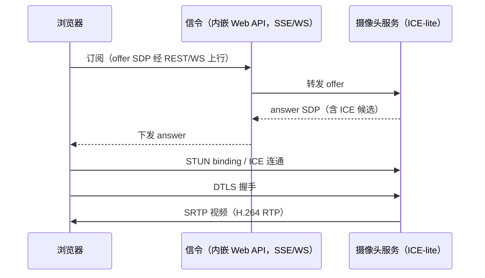
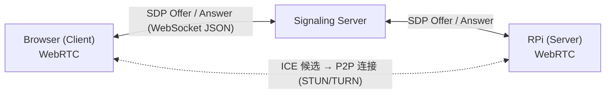

# WebRTC 流媒体功能设计文档

> **状态：规划中，未实现**。配置 `[features.webrtc] enabled = true`
> 仅记录告警并优雅降级。本文为设计文档，非实现文档。

## 设计意图 (Design Intent)

WebRTC 流媒体功能旨在为 mibee-eye-raspi-rs 提供浏览器原生的实时视频流能力，无需插件或第三方客户端。相比 RTSP，WebRTC 具有更低的延迟（<500ms）、更好的网络适应性（自适应码率）和更广泛的客户端支持（所有现代浏览器）。

当前系统仅支持 RTSP 流媒体，用户需要安装专用播放器（如 VLC、ffplay）或使用浏览器插件才能观看视频。WebRTC 将大大降低用户使用门槛，支持通过普通网页直接观看监控画面，同时支持双向音频和实时数据通道。

**核心应用场景：**
- 实时监控预览（低延迟）
- 浏览器直接访问（无需插件）
- 移动端查看（手机浏览器）
- 双向音频通话（如对讲机）
- 实时数据传输（如元数据叠加）

## 未来方向与技术选型 (Future Direction & Tech Stack)

### 技术路线

WebRTC 流媒体将采用标准的 WebRTC 协议栈，实现信令、ICE、DTLS、SRTP 等组件。根据 Rust 生态现状，有以下实现路径：



#### 路径 A: webrtc-rs（推荐）

**库信息：**
- Crate: `webrtc` (rust-webrtc/webrtc)
- 许可证: MIT/Apache-2.0
- 依赖: C 库（libsrtp、openssl 等）或纯 Rust 实现
- 状态: 活跃开发，API 相对稳定

**优势：**
- 完整的 WebRTC 协议栈实现
- 支持 DataChannel、音频/视频、Screen Sharing
- 支持 TURN/STUN 穿透
- 文档完善，示例代码丰富

**劣势：**
- 依赖较多 C 库（libsrtp、openssl、usrsctp）
- 编译时间较长
- ARM64 交叉编译可能需要额外配置

**示例代码：**

```rust
// 未来 API，当前未实现
use webrtc::api::peer_connection::*;
use webrtc::api::media_engine::*;
use webrtc::track::track_local::*;

// 创建 PeerConnection
let mut m = MediaEngine::default();
m.register_default_codecs()?;
let mut api = APIBuilder::new().with_media_engine(m).build();

let pc = api.new_peer_connection(Configuration::default()).await?;

// 添加视频轨道
let video_track = Arc::new(TrackLocalStaticSample::new(
    RTCRtpCodecCapability {
        mime_type: MIME_TYPE_H264.to_owned(),
        ..Default::default()
    },
    "video".to_owned(),
    "webrtc".to_owned(),
));
pc.add_track(Arc::clone(&video_track) as Arc<dyn TrackLocal + Send + Sync>).await?;

// 处理 SDP Offer/Answer
let offer = SessionDescription::offer(sdp_offer)?;
pc.set_remote_description(offer).await?;
let answer = pc.create_answer(None).await?;
pc.set_local_description(answer).await?;
let sdp_answer = pc.pending_local_description()?.await?;

// 发送视频帧
let sample = RtpCodecParameters {
    payload_type: 96,
    ..Default::default()
};
video_track.write(&sample, &VideoFrame { ... }).await?;
```

#### 路径 B: str0m（纯 Rust）

**库信息：**
- Crate: `str0m` (davidgrs/str0m)
- 许可证: MIT/Apache-2.0
- 依赖: 纯 Rust，无 C 库
- 状态: 新兴项目，API 变动较快

**优势：**
- 纯 Rust 实现，无 C 依赖
- 编译速度快
- 更易审计和调试

**劣势：**
- API 不稳定，可能频繁变更
- 功能可能不如 webrtc-rs 完整
- 社区相对较小

#### 路径 C: WebRTC P2P via Signaling Server

**架构：**



**信令协议：**
- WebSocket (ws:// 或 wss://)
- 消息格式: JSON
- 消息类型: `offer`, `answer`, `ice-candidate`, `close`

**消息示例：**

```json
// Client → Server: Offer
{
  "type": "offer",
  "sdp": "v=0\r\no=- 123456 2 IN IP4 192.168.1.100\r\n..."
}

// Server → RPi: Offer
{
  "type": "offer",
  "sdp": "v=0\r\no=- 123456 2 IN IP4 192.168.1.31\r\n...",
  "session_id": "sess-abc123"
}

// RPi → Server: Answer
{
  "type": "answer",
  "sdp": "v=0\r\no=- 789012 2 IN IP4 192.168.1.31\r\n...",
  "session_id": "sess-abc123"
}

// Server → Client: Answer
{
  "type": "answer",
  "sdp": "v=0\r\no=- 789012 2 IN IP4 192.168.1.31\r\n..."
}

// ICE Candidate (双方)
{
  "type": "ice-candidate",
  "candidate": "candidate:1 1 UDP 2130706431 192.168.1.31 54400 typ host",
  "session_id": "sess-abc123"
}
```

### 推荐路径

**优先选择：路径 A (webrtc-rs)**
- 生态成熟，文档完善
- 功能完整，满足 NVR 场景需求
- 有丰富的示例代码可参考

**备用路径：路径 C (手动实现 P2P)**
- 如果 webrtc-rs 依赖过多导致编译问题
- 或需要更轻量级的实现

### Cargo 依赖（未来）

```toml
[dependencies]
# WebRTC 核心库
webrtc = { version = "0.11", optional = true }

# 信令服务器
tokio-tungstenite = "0.23"  # WebSocket
serde = { version = "1", features = ["derive"] }
serde_json = "1"

# STUN/TURN
stun = "0.5"

[features]
default = ["webrtc"]
webrtc = ["dep:webrtc"]
```

## 硬件门控逻辑 (Hardware Gating Logic)

WebRTC 流媒体对硬件要求相对宽松，主要受网络带宽限制。无需专门的硬件编码器（已有 H.264 硬件编码器即可复用）。

### 必需硬件

| 硬件规格 | 最低要求 | 推荐配置 | 说明 |
|---------|---------|---------|------|
| **网络** | ≥ 2 Mbps | ≥ 10 Mbps | 上行带宽决定客户端观看质量 |
| **CPU** | ARMv8 (4核) | ARM Cortex-A72+ | WebRTC 握手和 ICE 穿透需要 CPU |

### 网络带宽要求

| 视频质量 | 码率 | 同时观看人数 | 总带宽要求 |
|---------|------|------------|-----------|
| **720p** | 2 Mbps | 1 人 | 2 Mbps |
| **720p** | 2 Mbps | 5 人 | 10 Mbps |
| **1080p** | 4 Mbps | 1 人 | 4 Mbps |
| **1080p** | 4 Mbps | 3 人 | 12 Mbps |

### NAT 穿透要求

| 场景 | 需求 | 推荐方案 |
|------|------|---------|
| **局域网内** | 无需穿透 | 直连（无需 STUN） |
| **公网访问** | 需要 STUN | coturn 或 pion TURN 服务器 |
| **企业网络** | 需要 TURN | 自建或使用云 TURN 服务 |

### 检测逻辑

基于 `src/hardware/capability.rs` 的检测：

```rust
// 未来 API，当前未实现
pub struct WebRtcCapabilityGate {
    network_upstream_mbps: u64,
    has_nat: bool,
}

impl WebRtcCapabilityGate {
    pub fn should_enable(&self) -> bool {
        // WebRTC 始终启用，但根据网络质量调整码率
        true
    }

    pub fn recommended_bitrate(&self) -> u64 {
        // 根据上行带宽动态调整
        (self.network_upstream_mbps * 1024 * 1024) / 2  // 保守估计 50%
    }

    pub fn needs_turn(&self) -> bool {
        self.has_nat
    }
}
```

## 接口契约 (Interface Contract)

### 核心 Trait 定义

```rust
// 未来 API，当前未实现
use async_trait::async_trait;

/// WebRTC 流媒体器 Trait
#[async_trait]
pub trait WebRtcStreamer: Send + Sync {
    /// 从收到的 SDP Offer 创建新 WebRTC 会话并返回 SDP Answer
    ///
    /// # 参数
    /// - `sdp_offer`: 客户端发送的 SDP Offer 字符串
    ///
    /// # 返回
    /// - `Ok(String)`: 服务器的 SDP Answer 字符串
    /// - `Err(FeatureError)`: 会话创建失败（如格式错误、资源不足）
    ///
    /// # 说明
    /// 此方法启动 P2P 连接握手流程，内部会：
    /// 1. 解析 SDP Offer
    /// 2. 创建 PeerConnection
    /// 3. 设置远程描述
    /// 4. 生成 SDP Answer
    /// 5. 设置本地描述
    /// 6. 开始 ICE 穿透
    async fn create_session(&self, sdp_offer: &str) -> Result<String, FeatureError>;

    /// 关闭活动的 WebRTC 会话
    ///
    /// # 参数
    /// - `id`: 会话 ID（由 create_session 返回或自动生成）
    ///
    /// # 返回
    /// - `Ok(())`: 会话关闭成功
    /// - `Err(FeatureError)`: 会话关闭失败（如 ID 不存在）
    ///
    /// # 说明
    /// 此方法会：
    /// 1. 停止视频轨道发送
    /// 2. 关闭 PeerConnection
    /// 3. 释放 ICE 候选资源
    /// 4. 清理会话状态
    async fn close_session(&self, id: &str) -> Result<(), FeatureError>;
}
```

### 扩展接口（未来）

```rust
// 未来 API，当前未实现
pub trait WebRtcStreamerExt: WebRtcStreamer {
    /// 获取活动会话列表
    async fn list_sessions(&self) -> Result<Vec<SessionInfo>, FeatureError>;

    /// 发送 ICE 候选
    async fn add_ice_candidate(&self, id: &str, candidate: &str) -> Result<(), FeatureError>;

    /// 发送视频帧到指定会话
    async fn send_video_frame(&self, id: &str, frame: VideoFrame) -> Result<(), FeatureError>;

    /// 设置视频码率
    async fn set_bitrate(&self, id: &str, bitrate_kbps: u32) -> Result<(), FeatureError>;
}
```

### 配置接口（未来）

```toml
# 未来配置，当前未实现
[webrtc]
enabled = true
port = 8443
max_sessions = 10
default_bitrate = 2000  # kbps

[webrtc.ice]
stun_servers = ["stun:stun.l.google.com:19302"]
turn_servers = []  # 如需 TURN，配置这里

[webrtc.video]
codec = "h264"  # "h264" | "vp8" | "vp9"
resolution = [1280, 720]
framerate = 30
```

### 错误处理

```rust
// 未来 API，当前未实现
pub enum WebRtcError {
    InvalidSdp(String),
    SessionNotFound(String),
    SessionLimitReached { max: u32 },
    IceNegotiationFailed(String),
    NetworkError(String),
}
```

## 解锁条件 (Unlock Conditions)

### 技术准备

- [ ] **WebRTC 库集成**
  - [ ] 评估 webrtc-rs 和 str0m，选择一个
  - [ ] 集成 WebRTC 核心库到项目
  - [ ] 实现 PeerConnection 创建和管理
  - [ ] 实现 SDP Offer/Answer 交换

- [ ] **视频轨道集成**
  - [ ] 将 AuHub 的 H.264 输出连接到 WebRTC 视频轨道
  - [ ] 实现视频帧格式转换（Annex-B → RTP Payload）
  - [ ] 实现码率控制（根据网络状况动态调整）
  - [ ] 实现关键帧请求（PLI/FIR）

- [ ] **信令服务器**
  - [ ] 实现 WebSocket 信令服务器
  - [ ] 实现 SDP Offer/Answer 消息处理
  - [ ] 实现 ICE 候选交换
  - [ ] 实现会话生命周期管理

- [ ] **NAT 穿透**
  - [ ] 配置 STUN 服务器（如 stun.l.google.com）
  - [ ] 测试局域网直连（无需 STUN）
  - [ ] 测试公网访问（需要 STUN）
  - [ ] 评估 TURN 服务器需求（可选）

- [ ] **客户端实现**
  - [ ] 实现浏览器端 WebRTC 客户端（JavaScript）
  - [ ] 实现信令消息处理
  - [ ] 实现视频渲染（HTML5 Video）
  - [ ] 实现错误处理和重连逻辑

### 质量保证

- [ ] 单元测试（SDP 解析、ICE 候选）
- [ ] 集成测试（完整的 WebRTC 握手流程）
- [ ] 性能测试（延迟、码率、丢包）
- [ ] 网络测试（不同网络环境下的表现）
- [ ] 浏览器兼容性测试（Chrome, Firefox, Safari）

### 性能优化

- [ ] 实现 WebRTC 会话池（复用 PeerConnection）
- [ ] 实现 Simulcast（多码率同时发送）
- [ ] 实现 SVC（可分级视频编码，如 VP9/AV1）
- [ ] 优化视频帧缓冲区（减少延迟）

### 文档与配置

- [ ] WebRTC 协议栈架构文档
- [ ] 信令协议规范（消息格式、时序图）
- [ ] 配置文件示例（STUN/TURN、码率、分辨率）
- [ ] 故障排查手册（连接失败、无视频、卡顿）
- [ ] 客户端集成指南（第三方如何集成）

### 安全考虑

- [ ] STUN/TURN 认证（如使用自建 TURN）
- [ ] DTLS 加密（WebRTC 标准强制）
- [ ] 访问控制（哪些 IP 可以连接）
- [ ] 会话超时（防止资源泄漏）

### 发布检查

- [ ] 默认配置安全（不暴露不必要的服务）
- [ ] 优雅降级（WebRTC 失败时回退到 RTSP）
- [ ] 资源限制（最大会话数、最大码率）
- [ ] 隐私保护（不记录视频内容，仅日志）